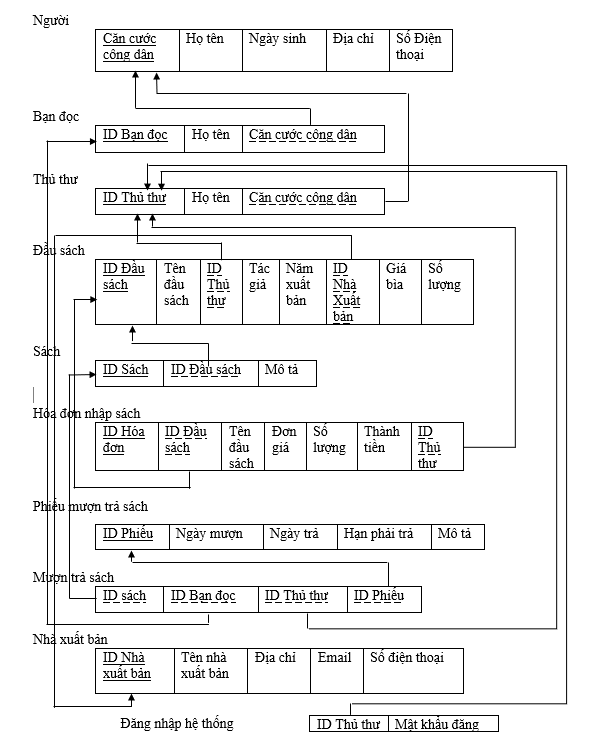
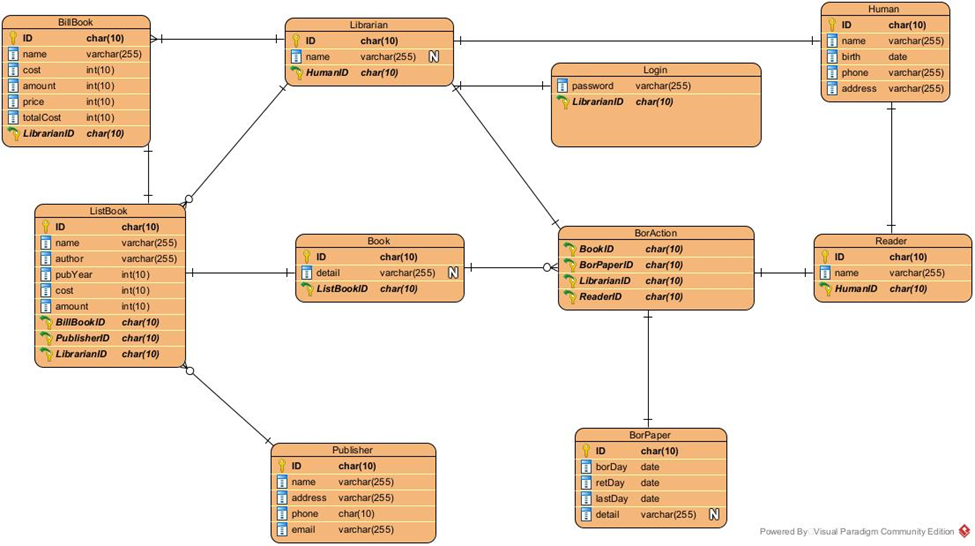

# **Library**

+ Dự án cho phép quản thư sử dụng để quản lý thư viện

## Mục đích

+ Phần mềm giúp người sử dụng có thể quản lý việc nhập, xuất các đầu sách, tìm kiếm các đầu sách và quản lý lịch sử mượn sách của độc giả 

## Công nghệ sử dụng 

+ Sử dụng ngôn ngữ lập trình Java 
+ Sử dụng framework Java Spring Boot để xây dựng web
+ Sử dụng MySQL làm công cụ quản lý cơ sở dữ liệu 

## Các thiết kế chính 

+ Thiết kế logic 

+ Biểu đồ cơ sở dữ liệu 

